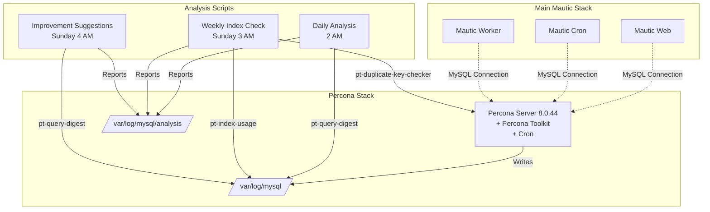
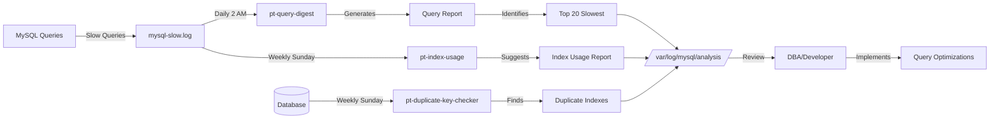
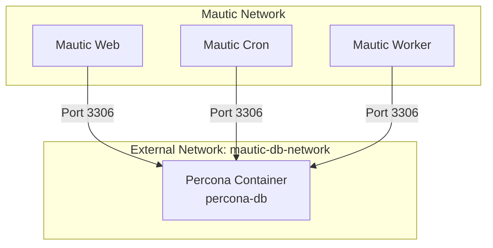

# Percona Slow Query Analysis Implementation Plan

## Overview

This plan extracts the Percona database into a separate Docker Compose setup with automated slow query analysis capabilities using Percona Toolkit.

## Architecture



## Slow Query Analysis Workflow



## Directory Structure

```
/home/dsonnet/repos/php/docker-mautic/
├── docker-compose.yml              # Modified - references external network
├── percona/                        # NEW - Separate Percona setup
│   ├── docker-compose.percona.yml  # Percona-specific compose file
│   ├── Dockerfile.percona          # Custom Dockerfile with Percona Toolkit
│   ├── .env.percona                # Database environment variables
│   ├── README.md                   # Setup and usage documentation
│   ├── scripts/                    # Analysis scripts
│   │   ├── analyze-slow-queries.sh
│   │   ├── analyze-indexes.sh
│   │   ├── suggest-improvements.sh
│   │   └── setup-cron.sh
│   └── logs/                       # Persistent log storage
│       └── analysis/               # Analysis reports stored here
```

## Network Architecture



## Implementation Steps

### 1. Directory Structure Setup
- Create `percona/` directory in project root
- Create `percona/scripts/` subdirectory for analysis scripts
- Create `percona/logs/` subdirectory for persistent log storage

### 2. Dockerfile Creation
**File:** `percona/Dockerfile.percona`

Key components:
- Base image: `percona/percona-server:8.0.44`
- Install Percona Toolkit via apt repository
- Install cron for automated scheduling
- Copy analysis scripts to `/opt/analysis/`
- Set executable permissions on scripts
- Create log directories

### 3. Analysis Scripts

#### Daily Slow Query Analysis (`analyze-slow-queries.sh`)
- Runs daily at 2 AM
- Uses `pt-query-digest` to analyze slow query log
- Generates report with top 20 queries by total time
- Rotates slow query log after analysis
- Cleans up reports older than 7 days

#### Weekly Index Analysis (`analyze-indexes.sh`)
- Runs Sunday at 3 AM
- Uses `pt-duplicate-key-checker` to find redundant indexes
- Uses `pt-index-usage` to analyze index efficiency from logs
- Generates comprehensive index report
- Suggests index improvements

#### Weekly Improvement Suggestions (`suggest-improvements.sh`)
- Runs Sunday at 4 AM
- Extracts top 10 slowest query patterns
- Provides EXPLAIN analysis
- Lists actionable recommendations

#### Cron Setup (`setup-cron.sh`)
- Configures cron jobs for automated analysis
- Runs during container initialization
- Logs cron execution to `/var/log/mysql/analysis/cron.log`

### 4. Environment Configuration
**File:** `percona/.env.percona`

Variables:
- `MYSQL_ROOT_PASSWORD`
- `MYSQL_DATABASE`
- `MYSQL_USER`
- `MYSQL_PASSWORD`
- `COMPOSE_PROJECT_NAME`

### 5. Docker Compose Configuration

#### Percona Compose (`percona/docker-compose.percona.yml`)
- Single `db` service
- Custom build from Dockerfile.percona
- Volume mounts:
  - `mysql-data:/var/lib/mysql` (database files)
  - `./logs:/var/log/mysql` (slow query logs - persistent)
  - `./scripts:/opt/analysis` (analysis scripts)
- MySQL command parameters:
  - `--slow_query_log=1`
  - `--slow_query_log_file=/var/log/mysql/mysql-slow.log`
  - `--long_query_time=1`
  - `--log_queries_not_using_indexes=1`
  - `--log_slow_admin_statements=1`
- Network: `mautic-db-network` (external, shared)
- Healthcheck: `mysqladmin ping`

#### Main Compose Update (`docker-compose.yml`)
- Remove `db` service definition
- Update services to use external network `mautic-db-network`
- Change `db:mysql` links to reference external container name

### 6. Documentation
**File:** `percona/README.md`

Sections:
- Quick start guide
- Environment variable configuration
- Starting/stopping services
- Viewing analysis reports
- Manual analysis commands
- Troubleshooting

## Key Features

### Automated Analysis
- **Daily**: Slow query digest at 2 AM
- **Weekly**: Index analysis and improvement suggestions
- **Automatic**: Log rotation and cleanup

### Analysis Tools
- **pt-query-digest**: Primary slow log analyzer
- **pt-duplicate-key-checker**: Finds redundant indexes
- **pt-index-usage**: Analyzes index efficiency
- **pt-visual-explain**: Visual query plans (manual use)

### Reports Generated
1. `slow-query-report-YYYYMMDD_HHMMSS.txt`
2. `index-analysis-YYYYMMDD_HHMMSS.txt`
3. `improvements-YYYYMMDD_HHMMSS.txt`
4. `cron.log` (cron execution log)

### Key Metrics Tracked
- Query execution time (total and average)
- Rows examined vs rows returned
- Queries not using indexes
- Full table scans
- Duplicate/redundant indexes
- Lock wait times

## Usage

### Starting the Percona Stack
```bash
cd percona
docker-compose -f docker-compose.percona.yml up -d
```

### Starting the Main Mautic Stack
```bash
cd /home/dsonnet/repos/php/docker-mautic
docker-compose up -d
```

### Viewing Analysis Reports
```bash
cd percona/logs/analysis
ls -lht  # List reports by date
cat slow-query-report-*.txt  # View specific report
```

### Manual Analysis
```bash
# Access container
docker exec -it percona-db bash

# Run immediate analysis
pt-query-digest /var/log/mysql/mysql-slow.log

# Check for duplicate indexes
pt-duplicate-key-checker -h localhost -u root -p

# Analyze specific query
mysql -u root -p -e "EXPLAIN SELECT ..." database_name
```

### Stopping Services
```bash
# Stop Mautic stack
cd /home/dsonnet/repos/php/docker-mautic
docker-compose down

# Stop Percona stack
cd percona
docker-compose -f docker-compose.percona.yml down
```

## Testing Plan

1. **Build Test**: Verify Dockerfile builds successfully
2. **Service Start Test**: Confirm Percona container starts and is healthy
3. **Network Test**: Verify Mautic services can connect to database
4. **Script Test**: Manually trigger each analysis script
5. **Cron Test**: Wait for scheduled execution or manually test cron
6. **Report Test**: Verify reports are generated in correct location
7. **Log Rotation Test**: Verify old logs are cleaned up

## Migration Strategy

1. Extract Percona configuration from existing setup
2. Build and test new Percona stack independently
3. Update main docker-compose.yml to use external network
4. Test connectivity between stacks
5. Deploy both stacks together
6. Verify all Mautic services can access database
7. Monitor analysis reports generation

## Benefits

- **Separation of Concerns**: Database isolated from application stack
- **Independent Management**: Database can be started/stopped separately
- **Automated Monitoring**: No manual intervention needed for analysis
- **Historical Tracking**: 7-day retention of analysis reports
- **Performance Insights**: Regular reports identify optimization opportunities
- **Minimal Impact**: Analysis runs during low-traffic hours
- **Easy Scaling**: Database stack can be scaled independently

## Notes

- Analysis scripts run during low-traffic hours (2-4 AM)
- Reports retained for 7 days (configurable)
- Slow query log rotated daily
- Long query time threshold: 1 second (configurable)
- Network must be created before starting services
